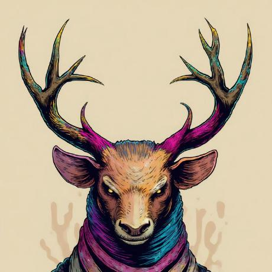

# 𓃶 Mikey88fr
**[UNMODERATED HUMAN] | [NON-ALGORITHMIC]**

---

### I. MANIFESTO
**STATUS:** `NON_COMPLIANT`

> "I am a novice navigating the rapid ██████ shifts of AI. While the machine predicts the next word, I am building the spaces it cannot understand. Logic is a tool; **wonder** is the objective. I refuse to be ██████ replaced by a simulation."

---

### II. PROJECT_RECLAMATION
**Designation: THE_ESOTERIC**
Purpose: ██████ blending art and tech. A digital canvas for **late-night radio** and the **unexplained**. Reclaiming the "weird" from the sanitized web.
Status: `UNFILTERED`

---

### III. THE PRIMAL TOOLBOX
*Foundations from the MySpace era, sharpened for the modern struggle.*

- **PYTHON**: `Deconstructing_the_logic`
- **SQL**: `Retrieving_the_truth`
- **HTML/CSS/JS**: `Building_the_resistance`

---

### IV. STRUCTURE & UPLINK
- **LOCATION**: Melbourne, VIC
- **UPLINK**: [the-king@the-esoteric.com.au](mailto:the-king@the-esoteric.com.au)
- **PROTOCOL**: Verify integrity. If reinitialization loops, ████████████.

  

